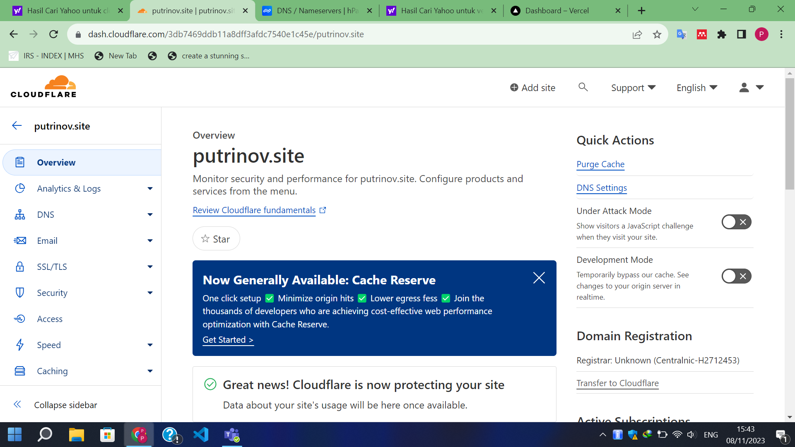

Visit responsive website travel at https://responsive-website.putrinov.site/

## Deployment Process

### Sign up on Vercel
1. First visit https://vercel.com/
2. Click Sign Up with GitHub then Fill your GitHub username and password then click sign in, you will get redirect to netlify account dashboard.

### Deploy Website from Github to Vercel
1. On Vercel Dashboard Click add new site choose import an existing project

2. Choose Repository you want to deploy 

3. Then Click Deploy 

### Buy Domain on Niagahoster
1. visit niagahoster.com then create account
2. Search your prefered domain name and Choose domain name that you want to buy

3. Choose your payment option to buy your domain and finish the transaction

4. Congrats you are now have your own domain name

### Connect Niagahoster with Cloudflare
1. visit cloudflare.com and create account
2. register your domain that you buy on niagahoter, Click continue, if there is warning ignore it. we will add the DNS record after niagahoster and cloudflare succed to connect

3. Go to niagahoster then change the nameserver on niagahoster with nameserver that cloudflare provided. it take times to connect niagahoster and cloudflare aproximatly 1-24 hours and Change DNSSEC on niagahoster after Turn DNSSEC on Through cloudflare
.png)

4. Back to cloudflare check if DNS record updated 

### Add Custom Domain to Vercel and Connect it with Cloudflare
1. Go to Cloudflare, in the DNS record add the IP address of your Vercel deployment website! It's important to use the "CNAMA" type.

2. Go to your vercel dashboar, click domain at your deployment website and add domain. Check on your vercel dashboard to ensure your domain is properly cofigurated and connected to your netlify website

